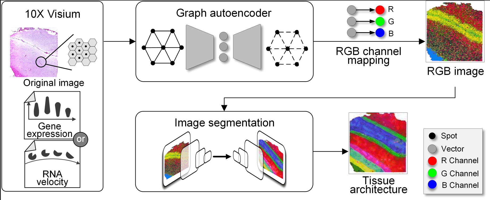

# About

```RESEPT``` is a deep-learning framework for characterizing and visualizing tissue architecture from spatially resolved transcriptomics. 

Given inputs as gene expression or RNA velocity, RESEPT learns a three-dimensional embedding with a spatial retained graph neural network from the spatial transcriptomics. The embedding is then visualized by mapping as color channels in an RGB image and segmented with a supervised convolutional neural network model for inferring the tissue architecture accurately. 




### RESEPT ’s features

- Converts spatial transcriptomics data as an RGB image describing various spatial contexts together with expression abundance faithfully 
- Predicts spatial cell types on the RGB image
- Integrats RNA velocity into image training
- Recognizes the spatial pattern and detects the corresponding active functional regions with a defined panel of gene sets 


### Built With
*	[opencv](https://opencv.org/) - The image processing library used
*	[pytorch](https://pytorch.org/) - The deep learning backend used
*	[scikit-learn](https://scikit-learn.org/stable/) - The machine learning library used
*	[mmSegmentation](https://github.com/open-mmlab/mmsegmentation) - The image segmentation library used
### License
This software is licensed under the MIT License - see the [LICENSE.md](https://github.com/coffee19850519/single_cell_spatial_image/blob/main/LICENSE.md) file for details

