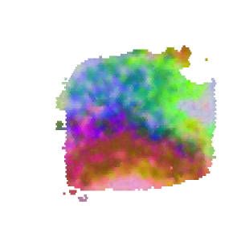

### Customize segmentation model 

RESEPT supports fine-tuning our segmentation model by using users' 10x Visium data. Organize all samples and their annotations according to our pre-defined data schema and download our pre-trained model from [here](https://bmbl.bmi.osumc.edu/downloadFiles/GitHub_files/model_S13.zip) as a training start point. Each sample for the training model should be placed in an individual folder with a specific format (the folder structure can be found [here](https://github.com/coffee19850519/single_cell_spatial_image#data-structure)). Then gather all the individual folders into one main folder (e.g., named “training_data_folder”).  For demonstration, download the example training data from [here](https://bmbl.bmi.osumc.edu/downloadFiles/GitHub_files/training_data_folder.zip), and then run the following command line to generate the RGB images of your own data and customized model.

```
wget https://bmbl.bmi.osumc.edu/downloadFiles/GitHub_files/model_S13.zip
wget https://bmbl.bmi.osumc.edu/downloadFiles/GitHub_files/training_data_folder.zip
unzip model_S13.zip
unzip training_data_folder.zip
python training_pipeline.py -data_folder training_data_folder -output Demo_result_model -embedding scGNN  -transform logcpm -model model_S13/S13_scGNN.pth
```

#### Command Line Arguments:

* -data_folder a folder provides all training samples. The data including label file of each sample should follow our pre-defined schema in a sub-folder under this folder. [type:str]
* -model file path for pre-trained model file. [type:str]
* -output output root folder. [type:str]
* -embedding embedding method in use: scGNN or spaGCN. [type: str] [default: scGNN]
* -transform data pre-transform method: log, logcpm or None. [type: str] [default: logcpm]

#### Results

RESEPT stores the generative results in the following structure:

   ```
   Demo_result_model/
   |__RGB_images/
   
   work_dirs/
   |__config/
         |__epoch_50.pth
   ```

*	-The folder 'RGB_images' contains generated RGB images of tissue architectures of all input 10x data from different embedding parameters. 
*	-The file 'epoch_50.pth' is the customized model.
*	-This Demo takes about 3 hours to generate the model on a machine with a 2080Ti GPU.
*	-An example of generative visuals of tissue architectures and its label image are shown below:

 
