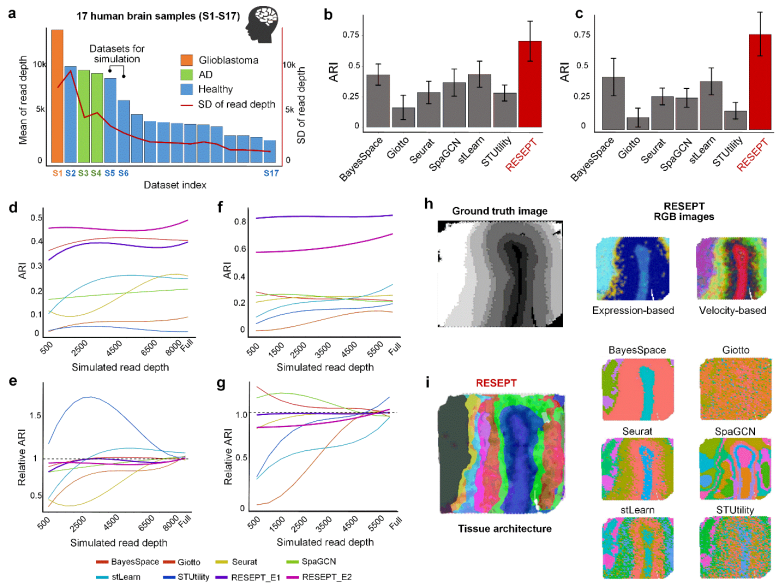
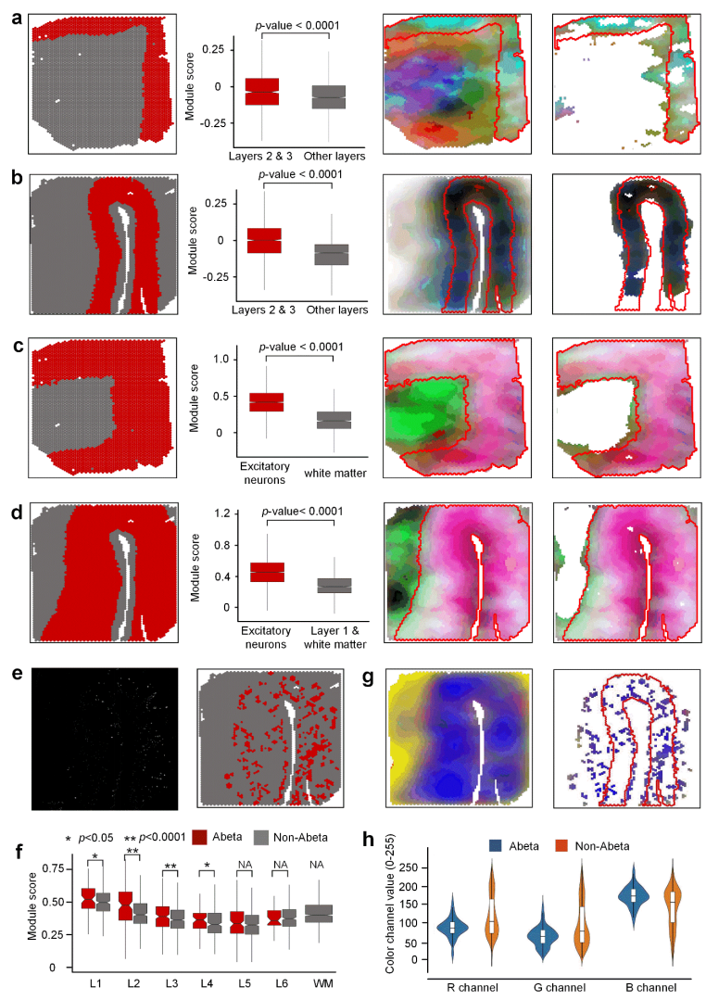
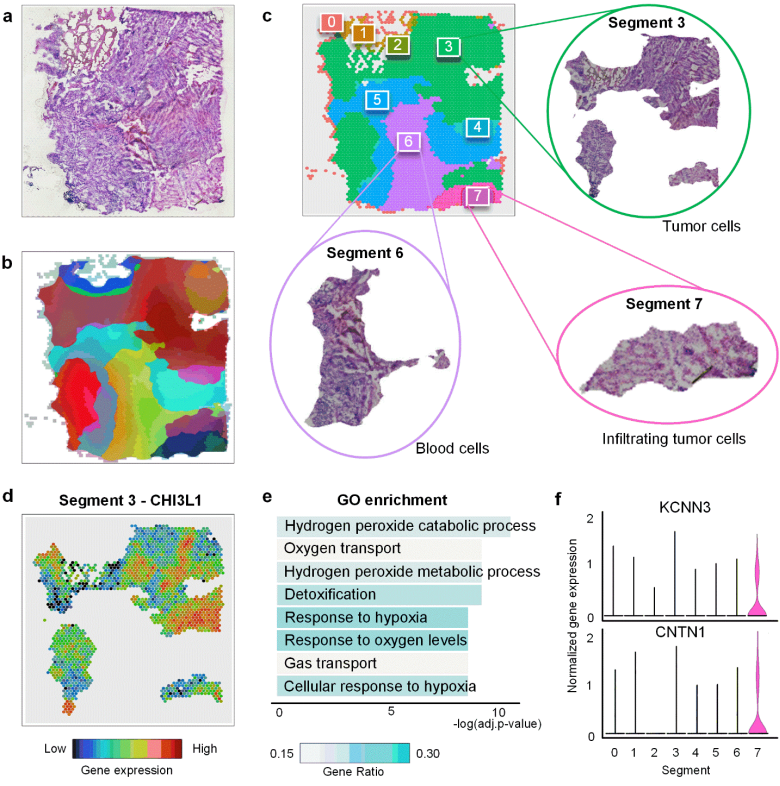

# Downstream analyses

 

## Spatial architecture identification of RESEPT

 

Using manual annotations as the ground truth on 12 published samples and 4 in-house samples sequenced on the 10x Genomics Visium platform, RESEPT was benchmarked on both raw and normalized expression matrices of the 16 samples. Our results demonstrate RESEPT outperforms six existing tools, namely Seurat, BayesSpace, SpaGCN, stLearn, STUtility, and Giotto on tissue architecture identification in terms of Adjusted Rand Index (ARI) **0.706±0.163** (**Fig. 5b**). To validate the robustness of our model, we generated simulation data with gradient decreasing sequencing depth based on two selected datasets S5 and S6 (**Fig. 5a**). In the downsampling read depth gradients from very low depth to full depth, RESEPT demonstrated robustness of ARI **0.454±0.014** on S5, ARI **0.809±0.006** on S6 (**Fig. 5d-g**).  It is noteworthy that RGB images generated from RNA velocity can reveal clear spatial separation between segments from the identified architecture on the AD sample S4 (Moran's I 0.920 vs 0.787), which is consistent with the brain development zonation (**Fig. 5h**). On the same sample, RESEPT reveals better tissue architecture than the other tools in ARI 0.409 (**Fig. 5i**). 

 

**Figure 5**| The performance of spatial architecture identification of RESEPT 

 

## Spatially related biological insights of RESEPT

With our in-house AD brain samples, human postmortem middle temporal gyrus (MTG) from an AD case (Sample S4) was spatially profiled on the 10x Visium platform, and RESEPT successfully identified the main architecture of the MTG comparing with the manual annotation as the ground truth (S3 ARI = 0.474; S4 ARI=0.409). With the RGB image generated from gene expression, we identified cortical layers 2 & 3, regions with excitatory neurons, and amyloid-beta (Aβ) plaques. For the AD sample on cortical layers 2 & 3 (ground truth as **Fig. 6a-b**), well-defined marker genes (C1QL2, RASGRF2, CARTPT, WFS1, HPCAL1 for layer 2, and CARTPT, MFGE8, PRSS12, SV2C, HPCAL1 for layer 3). To validate the spatial specificity, module scores from Seurat showed that these marker genes are statistically significantly enriched only on cortex layers 2 & 3 among all the layers (**p**<0.0001 by Wilcoxon signed-rank test). Furthermore, RESEPT visually provided consistent colors for cortical layers 2 & 3. These spatial patterns were strengthened by filtering unrelated colors. To reveal critical cell-type distribution (**i.e.** , [excitatory neuron](https://www.google.com/search?safe=strict&rlz=1C1CHBF_enUS864US864&sxsrf=ALeKk01kQLpGUoghYFhIITgzNLqegZn7ZA:1622568724487&q=excitatory+neuron&spell=1&sa=X&ved=2ahUKEwiG6sjD-_bwAhUMCs0KHatvApEQkeECKAB6BAgBEDE)) associated with selective neuronal vulnerability in AD2, five well-defined excitatory neuron marker genes (SLC17A6, SLC17A7, NRGN, CAMK2A, and SATB2) in the cortex were obtained from our in-house database scREAD. The module score and optimized RGB image (**Fig. 6c-d**) showed statistically significant enrichment of excitatory neuron marker genes in cortical layers 2-6 (**p**<0.0001 by Wilcoxon signed-rank test), and the original and improved RGB image also localized the excitatory neurons. Moreover, the RGB image can reflect an important AD pathology-associated region, i.e., Aβ plaques-accumulated region. We conducted an immunofluorescence staining of Aβ on the adjacent AD brain section and identified the brain region with Aβ plaques (**Fig. 6e**). Among the gene module containing 57 Aβ plaque-induced genes discovered from the previous study, we validated those 20 upregulated genes showed the specific enrichment in the Aβ region compared to the non-Aβ region in terms of layers 2 & 3 (**p**<0.0001 by Wilcoxon signed-rank test, **Fig. 6f**). By comparing the color in Aβ region-associated spots with the RGB image (**Fig. 6g**), we observed Aβ region-associated spots behaved a consistent color in layers 2 & 3. To evaluate RGB value variation quantitatively, we investigated the value range of channels R, G, and B for the Aβ region and non-Aβ region (**Fig. 6h**). The result showed that the Aβ region had a tight dispersion compared to the non-Aβ region, which proved the RGB image can be potentially used to indicate the Aβ pathological region. 

 

 

**Figure 6**| RESEPT identifies spatial cellular patterns in the human postmortem middle temporal gyrus (MTG). 

 

## The clinical and prognostic applications of RESEPT in cancer. 

To demonstrate the clinical and prognostic applications of RESEPT in the oncology field, we analyzed a glioblastoma dataset published by 10x Genomics using the Visium platform(**Fig. 7a**, Sample S1). Assessment of tissue architecture represents a key diagnostic tool for patient prognosis and diagnosis. RESEPT identified eight segments (**Fig. 7b-c**) and distinguished tumor-enriched, non-tumor, and regions of neuropil with infiltrating glioblastoma cells. Based on the morphological features of Segment 3 in the Hematoxylin-Eosin (H&E) image (**Fig. 7c**), we observed pre-existing neurons, and many tumor cells located in this segment. Differentially expressed gene (DEG) analysis demonstrated that a pre-defined glioblastoma marker CHI3L123,24 was highly expressed in most of the spots in Segment 3 (**Fig. 7d**). By exploring the H&E image of Segment 6, we found this prominent area of the segment displayed blood cell morphological features, likely representing an area of acute hemorrhage during the surgical biopsy. This morphological observation was in line with the GO enrichment analysis, where DEGs were enriched in blood functionality pathways (**Fig. 7e**). Most interestingly, from the morphological features of Segment 7, we observed that this segment belongs to infiltrating glioblastoma cells characterized by elongate nuclei admixed with non-neoplastic brain cells. Comparing DEGs with pre-defined infiltrating markers25, we found that infiltrating tumor marker genes KCNN3 and CNTN1 were expressed specifically in Segment 7 (**Fig. 7f**). 

 

**Figure 7**| RESEPT identifies tumor regions in glioblastoma samples (Sample S1). 

