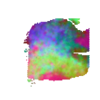
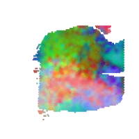
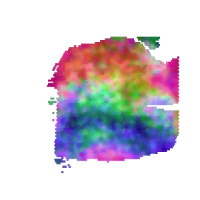
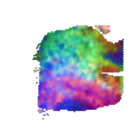
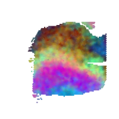
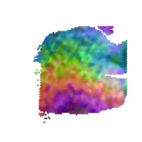

### Function 1:Visualize tissue architecture 

Run the following command line to construct RGB images based on gene expression from different embedding parameters. For demonstration, please download the example data from [here](https://bmbl.bmi.osumc.edu/downloadFiles/GitHub_files/S13.zip) and put the unzip folder 'S13' in the source code folder.

```
wget https://bmbl.bmi.osumc.edu/downloadFiles/GitHub_files/S13.zip 
unzip S13.zip
python RGB_images_pipeline.py -expression S13/S13_filtered_feature_bc_matrix.h5  -meta S13/spatial/tissue_positions_list.csv  -scaler S13/spatial/scalefactors_json.json -output Demo_result  -embedding scGNN  -transform logcpm 
```

#### Command Line Arguments:

*	-expression file path for raw gene expression data. [type:str]
*	-meta file path for spatial meta recording tissue positions. [type:str]
*	-scaler file path for scale factors. [type:str]
*	-output output root folder. [type:str]
*	-embedding embedding method in use: scGNN or spaGCN. [type:str] [default: scGNN]
*	-transform data pre-transform method: log, logcpm or None. [type:str] [default: logcpm]

#### Results

 ```RESEPT``` stores the generative results in the following structure:

   ```
   Demo_result/
   |__RGB_images/
   ```

*	The folder 'RGB_images' stores generative visuals of tissue architectures from different embedding parameters. 
*	This Demo takes 25-30 mins to generate all results on a machine with 64-core CPU.
*	An example of generative visuals of tissue architectures is shown below:


  

Figure 1: The examples of generative visuals of tissue architectures
