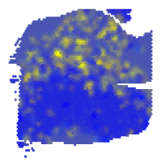
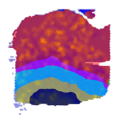
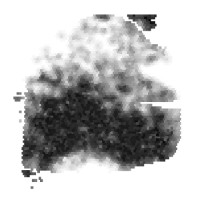
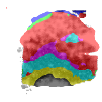
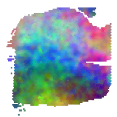
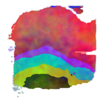
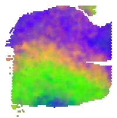
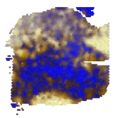
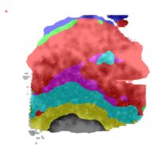
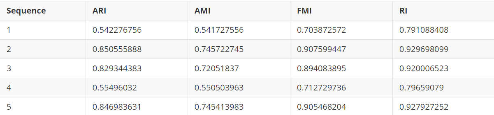

### Function 2: Evaluate predictive tissue architectures with annotation

Run the following command line to construct RGB images based on gene expression from different embedding parameters, segment the constructed RGB images to tissue architectures with top5 Moran's I, and evaluate the tissue architectures (e.g., ARI). For demonstration, please download the example data from [here](https://bmbl.bmi.osumc.edu/downloadFiles/GitHub_files/S13.zip) and the pre-trained model from [here](https://bmbl.bmi.osumc.edu/downloadFiles/GitHub_files/model_S13.zip). Then put unzip folders 'S13' and 'model_S13' in the source code folder.

```
wget https://bmbl.bmi.osumc.edu/downloadFiles/GitHub_files/S13.zip 
wget https://bmbl.bmi.osumc.edu/downloadFiles/GitHub_files/model_S13.zip
unzip S13.zip
unzip model_S13.zip
python evaluation_pipeline.py -expression S13/S13_filtered_feature_bc_matrix.h5  -meta S13/spatial/tissue_positions_list.csv  -scaler S13/spatial/scalefactors_json.json -output Demo_result_evaluation  -embedding scGNN  -transform logcpm -label S13/S13_annotation.csv -model model_S13/S13_scGNN.pth -device gpu
```

#### Command Line Arguments:

- -expression file path for raw gene expression data. [type: str]
- -meta file path for spatial meta data recording tissue positions. [type: str]
- -scaler file path for scale factors. [type: str]
- -label file path for labels recording spot barcodes and their annotations for calculating evaluation metrics. [type: str]
- -model file path for pre-trained model. [type: str]
- -output output root folder. [type: str]
- -embedding embedding method in use: scGNN or spaGCN. [type: str] [default: scGNN]
- -transform data pre-transform method: log, logcpm or None. [type: str] [default: logcpm]
- -device cpu/gpu device option: cpu or gpu. [type: str] [default: cpu] (CPU-based function is under development)

#### Results

RESEPT stores the generative results in the following structure:

   ```
      Demo_result_evaluation/
   |__RGB_images/
   |__segmentation_evaluation/
         |__segmentation_map/
         |__top5_evaluation.csv
   ```

*	-The folder 'RGB_images' contains the generated RGB images of tissue architectures from different embedding parameters. 
*	-The folder 'segmentation_map' stores the predicted tissue architectures with top-5 Moran's I.
*	-The file 'top5_evaluation.csv' records various evaluation metrics corresponding to the tissue architectures.
*	-This Demo takes 30-35 mins to generate all the results on a machine with a 64-core CPU.
*	-The generative visual of gene expression, segmentation map and its evaluation metric of best result among top5 Moran's I are shown below:

-   

-   

-   

-   

-   



**Figure 1**|The generated RGB images of tissue architectures and predicted tissue architectures with top-5 Moran’s I, and evaluation metrics corresponding to the tissue architectures.

