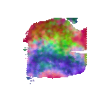
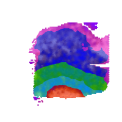
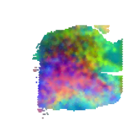
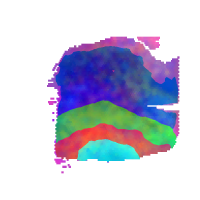
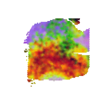
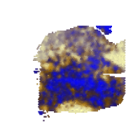
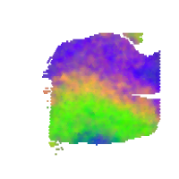
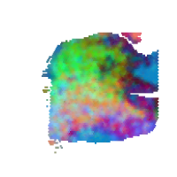
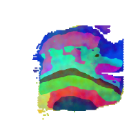

### Function 2: evaluate predictive tissue architectures with annotation
Run the following command line to construct RGB images based on gene expression from different embedding parameters, segment the constructed RGB images to tissue architectures with top-5 Moran's I, and evaluate the tissue architectures (e.g., ARI). For demonstration, please download the example data from [here](https://bmbl.bmi.osumc.edu/downloadFiles/GitHub_files/S10.zip) and the pretrained model from [here](https://bmbl.bmi.osumc.edu/downloadFiles/GitHub_files/model_S10.zip). Then put unzip folders 'S10' and 'model_S10' in the source code folder.
```
wget https://bmbl.bmi.osumc.edu/downloadFiles/GitHub_files/S10.zip 
wget https://bmbl.bmi.osumc.edu/downloadFiles/GitHub_files/model_S10.zip
unzip S10.zip
unzip model_S10.zip
python evaluation_pipeline.py -expression S10/S10_filtered_feature_bc_matrix.h5  -meta S10/spatial/tissue_positions_list.csv  -scaler S10/spatial/scalefactors_json.json -k 7 -label S10/S10_annotation.csv -model model_S10/S10_scGNN.pth -output Demo_result_evaluation  -embedding scGNN  -transform logcpm  -device cpu
```

#### Command Line Arguments:
*	-expression file path for raw gene expression data. [type: str]
*	-meta file path for spatial meta data recording tissue positions. [type: str]
*	-scaler file path for scale factors. [type: str]
*	-k the number of tissue architectures(setting -1 will recommend a K for you). [type: int] [default: 7]
*	-label file path for labels recording spot barcodes and their annotations for calculating evaluation metrics. [type: str]
*	-model file path for pre-trained model. [type: str]
*	-output output root folder. [type: str]
*	-embedding embedding method in use: scGNN, spaGCN, UMAP or SEDR. [type: str] [default: scGNN]
*	-transform data pre-transform method: log, logcpm or None. [type: str] [default: logcpm]
*	-device cpu/gpu device option: cpu or gpu. [type: str] [default: cpu]


#### Results
 ```RESEPT``` stores the generated results in the following structure:
   ```
      Demo_result_evaluation/
      |__RGB_images/
      |__segmentation_evaluation/
            |__segmentation_map/
            |__top5_evaluation.csv
   ```
*	The folder 'RGB_images' contains the generated RGB images of tissue architectures from different embedding parameters.
*	The folder 'segmentation_map' stores the predicted tissue architectures with top-5 Moran's I.
*	The file 'top5_evaluation.csv' records various evaluation metrics corresponding to the tissue architectures.  

This demo takes 30-35 mins to generate all results on the machine with a 64-core CPU.


-   
-   
-   
-   
-   


**Figure 2**| The generated RGB images of tissue architectures and predicted tissue architectures with top-5 Moran’s I, and evaluation metrics corresponding to the tissue architectures (k=7).


-   
- 
- 
- 
- 

**Figure 3**| The generated RGB images of tissue architectures and predicted tissue architectures with top-5 Moran’s I (k=5).


-   
-  
-  
-  
-  

**Figure 4**| The generated RGB images of tissue architectures and predicted tissue architectures with top-5 Moran’s I (k=8).
