### Function 3: predict tissue architecture without annotation
Run the following command line to generate RGB images based on gene expression from different embedding parameters and predict tissue architectures with top-5 Moran's I. For demonstration, please download the example data from [here](https://bmbl.bmi.osumc.edu/downloadFiles/GitHub_files/S10.zip) and the pre-trained model from [here](https://bmbl.bmi.osumc.edu/downloadFiles/GitHub_files/model_S10.zip). Then put unzip folders 'S10' and 'model_S10' in the source code folder.
```
wget https://bmbl.bmi.osumc.edu/downloadFiles/GitHub_files/S10.zip 
wget https://bmbl.bmi.osumc.edu/downloadFiles/GitHub_files/model_S10.zip 
unzip model_S10.zip
unzip S10.zip
python test_pipeline.py -expression S10/S10_filtered_feature_bc_matrix.h5  -meta S10/spatial/tissue_positions_list.csv  -scaler S10/spatial/scalefactors_json.json -output Demo_result_tissue_architecture  -embedding scGNN  -transform logcpm -model model_S10/S10_scGNN.pth -device cpu
```

#### Command Line Arguments:
*	-expression file path for raw gene expression data. [type: str]
*	-meta file path for spatial meta data recording tissue positions. [type: str]
*	-scaler file path for scale factors. [type: str]
*	-model file path for pre-trained model. [type: str]
*	-output output root folder. [type: str]
*	-embedding embedding method in use: scGNN or spaGCN. [type: str] [default: scGNN]
*	-transform data pre-transform method: log, logcpm or None. [type: str] [default: logcpm]
*	-device cpu/gpu device option: cpu or gpu. [type: str] [default: cpu]

#### Results
 ```RESEPT``` stores the generative results in the following structure:
   ```
   Demo_result_tissue_architecture/
   |__RGB_images/
   |__segmentation_test/
         |__segmentation_map/
         |__top5_MI_value.csv
   ```
*	The folder 'RGB_images' contains the generated RGB images of tissue architectures from different embedding parameters.
*	The folder 'segmentation_map' stores the predicted tissue architectures with top-5 Moran's I.
*	The file 'top5_MI_value.csv' records Moran's I value corresponding to the tissue architectures.  

This demo takes 30-35 mins to generate all the results on the machine with a 64-core CPU.

- 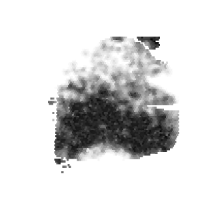  
-   
- 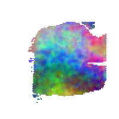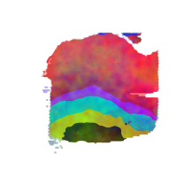  
-   
- 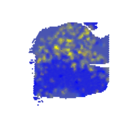  
 
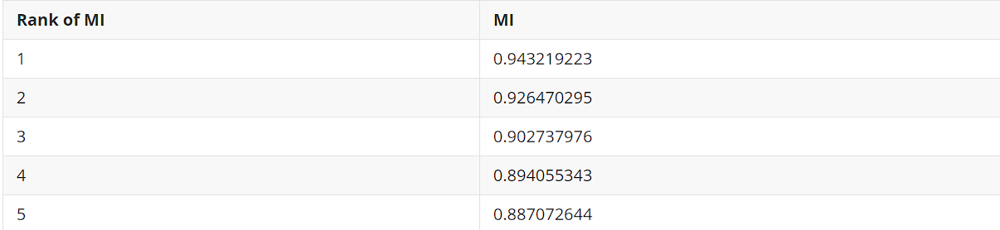

**Figure 5**| The generated RGB images of tissue architectures and predicted tissue architectures with top-5 Moran’s I, and corresponding Moran’s I value (k=7).


- 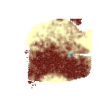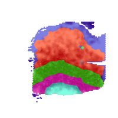  
- 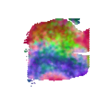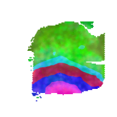
- 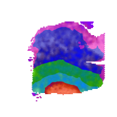
- 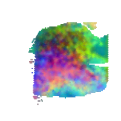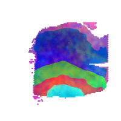
- 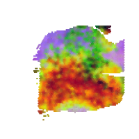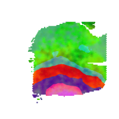

**Figure 6**| The generated RGB images of tissue architectures and predicted tissue architectures with top-5 Moran’s I (k=5).


- 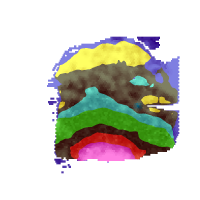  
- 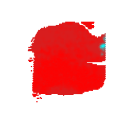 
- 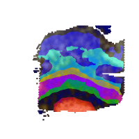 
- 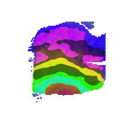 
- 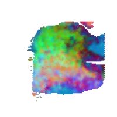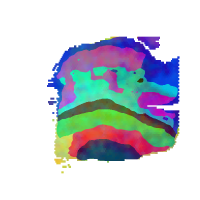 

**Figure 7**| The generated RGB images of tissue architectures and predicted tissue architectures with top-5 Moran’s I (k=8).
 
