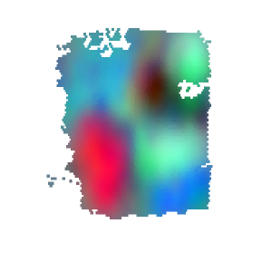
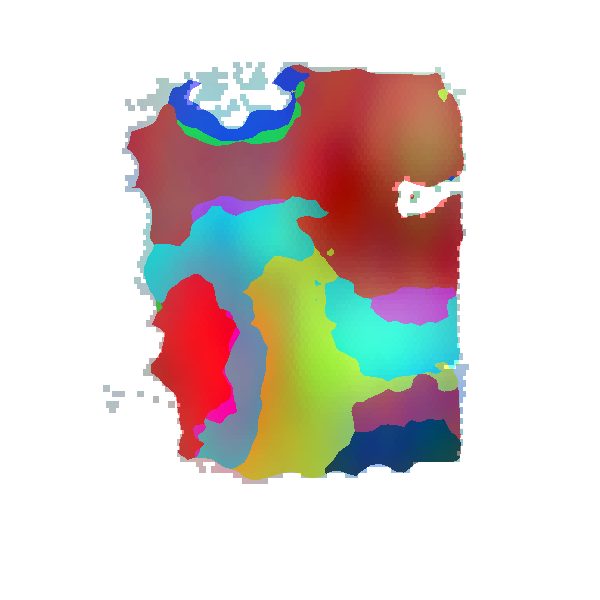
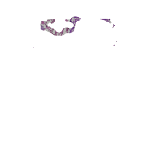
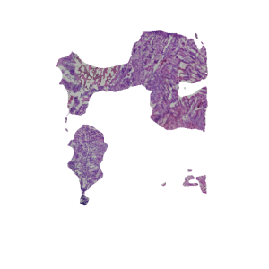
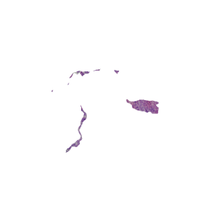
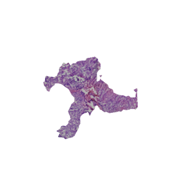
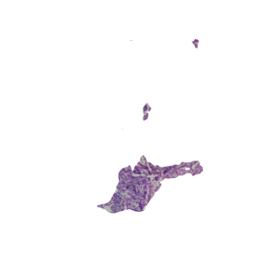
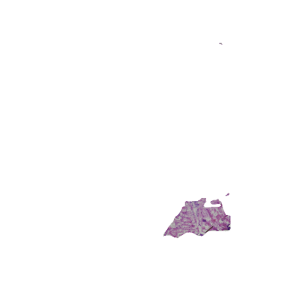

### Function 4: Segment a histological image

```RESEPT``` allows to segment a histological image according to predicted tissue architectures. It may help pathologists to focus on specific functional zonation. Run the following command line to predict tissue architectures with top-5 Moran's I and segment the histological image accordingly. For demonstration, please download the example data from [here](https://bmbl.bmi.osumc.edu/downloadFiles/GitHub_files/cancer.zip) and the pre-trained model from [here](https://bmbl.bmi.osumc.edu/downloadFiles/GitHub_files/model_cancer.zip). Then put unzip folders 'cancer' and 'model_cancer' in the source code folder.
```
wget https://bmbl.bmi.osumc.edu/downloadFiles/GitHub_files/cancer.zip
wget https://bmbl.bmi.osumc.edu/downloadFiles/GitHub_files/model_cancer.zip
unzip cancer.zip
unzip model_cancer.zip
python histological_segmentation_pipeline.py -expression ./cancer/Parent_Visium_Human_Glioblas_filtered_feature_bc_matrix.h5 -meta ./cancer/spatial/tissue_positions_list.csv -scaler ./cancer/spatial/scalefactors_json.json -k 7 -model ./model_cancer/cancer_model.pth -histological ./cancer/Parent_Visium_Human_Glioblast.tif -output Demo_result_HistoImage -embedding spaGCN -transform logcpm -device cpu
```

#### Command Line Arguments:
*	-expression file path for raw gene expression data. [type: str]
*	-meta file path for spatial meta data recording tissue positions. [type: str]
*	-scaler file path for scale factors. [type: str]
*	-k the number of tissue architectures(setting -1 will recommend a K for you). [type: int] [default: 7]
*	-model file path for pre-trained model. [type: str]
*	-histological file path for the corresponding histological image.[type: str]
*	-output output root folder. [type: str]
*	-embedding embedding method in use: scGNN, spaGCN, UMAP or SEDR. [type: str] [default: spaGCN]
*	-transform data pre-transform method: log, logcpm or None. [type: str] [default: logcpm]
*	-device cpu/gpu device option: cpu or gpu. [type: str] [default: cpu]
#### Results
 ```RESEPT``` stores the generative results in the following structure:
   ```
   Demo_result_HistoImage/
   |__RGB_images/
   |__segmentation_test/
   |     |__segmentation_map/
   |     |__top5_MI_value.csv
   |__histological_segmentation/
         |__category_1.png
         |__category_2.png
	          …
         |__category_n.png
   ```
*	The folder 'RGB_images' stores generated RGB images of tissue architectures from different embedding parameters.
*	The folder 'segmentation_map' provides predicted tissue architectures with top-5 Moran's I.
*	The file 'top5_MI_value.csv' records Moran's I value corresponding to the tissue architectures.
*	The file 'category_```n```.png' refers to the histological image segmentation results, where ```n``` denotes the segmentation number.   


This demo takes 30-35 mins to generate all results on the machine with the multi-core CPU.

 
 
 
 
  

**Figure 8**| The predicted tissue architectures with top-1 Moran’s I and corresponding histological image segmentation results.
