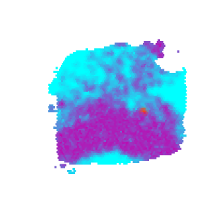

### Predict tissue architecture without annotation

Run the following command line to generate RGB images based on gene expression from different embedding parameters and predict tissue architectures with top-5 Moran's I. For demonstration, please download the example data from [here](https://bmbl.bmi.osumc.edu/downloadFiles/GitHub_files/S13.zip) and the pre-trained model from [here](https://bmbl.bmi.osumc.edu/downloadFiles/GitHub_files/model_S13.zip). Then put unzip folders 'S13' and 'model_S13' in the source code folder.

```
wget https://bmbl.bmi.osumc.edu/downloadFiles/GitHub_files/S13.zip 
wget https://bmbl.bmi.osumc.edu/downloadFiles/GitHub_files/model_S13.zip 
unzip model_S13.zip
unzip S13.zip
python test_pipeline.py -expression S13/S13_filtered_feature_bc_matrix.h5  -meta S13/spatial/tissue_positions_list.csv  -scaler S13/spatial/scalefactors_json.json -output Demo_result_tissue_architecture  -embedding scGNN  -transform logcpm -model model_S13/S13_scGNN.pth -device gpu
```

#### Command Line Arguments:

- -expression file path for raw gene expression data. [type: str]
- -meta file path for spatial meta data recording tissue positions. [type: str]
- -scaler file path for scale factors. [type: str]
- -label file path for labels recording spot barcodes and their annotations for calculating evaluation metrics. [type: str]
- -model file path for pre-trained model. [type: str]
- -output output root folder. [type: str]
- -embedding embedding method in use: scGNN or spaGCN. [type: str] [default: scGNN]
- -transform data pre-transform method: log, logcpm or None. [type: str] [default: logcpm]
- -device cpu/gpu device option: cpu or gpu. [type: str] [default: cpu] (CPU-based function is under development)

#### Results

RESEPT stores the generative results in the following structure:

   ```
      Demo_result_tissue_architecture/
   |__RGB_images/
   |__segmentation_test/
         |__segmentation_map/
         |__top5_MI_value.csv
   ```

*	-The folder 'RGB_images' contains the generated RGB images of tissue architectures from different embedding parameters. 
*	-The folder 'segmentation_map' stores the predicted tissue architectures with top5 Moran's I.
*	-The file 'top5_MI_value.csv' records Moran's I value corresponding to the tissue architectures.
*	-This demo takes 30-35 mins to generate all the results on the machine with a 64-core CPU.
*	-The generative visual of gene expression and segmentation map and its evaluation metric of top1 Moran's I are shown below:

 
