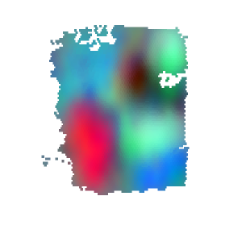
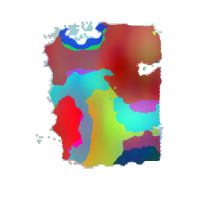

### Segment histological images

```RESEPT``` enables to segment histological images according to predictive tissue architectures. It may help pathologists to focus on some certain functional zonations. Run the following command line to predict tissue architectures with top5 Moran's I and segment histological images accordingly. For demonstration, please download the example data from [here](https://bmbl.bmi.osumc.edu/downloadFiles/GitHub_files/cancer.zip), the pre-trained model from [here](https://bmbl.bmi.osumc.edu/downloadFiles/GitHub_files/model_cancer.zip) and put unzip folders 'cancer' and 'model_cancer' in the source code folder.

```
wget https://bmbl.bmi.osumc.edu/downloadFiles/GitHub_files/cancer.zip
wget https://bmbl.bmi.osumc.edu/downloadFiles/GitHub_files/model_cancer.zip
unzip cancer.zip
unzip model_cancer.zip
python histological_segmentation_pipeline.py -expression ./cancer/Parent_Visium_Human_Glioblas_filtered_feature_bc_matrix.h5 -meta ./cancer/spatial/tissue_positions_list.csv -scaler ./cancer/spatial/scalefactors_json.json -histological ./cancer/Parent_Visium_Human_Glioblast.tif -output Demo_result_HistoImage -model ./model_cancer/cancer_model.pth -embedding spaGCN -transform logcpm
```

#### Command Line Arguments:

*	-expression file path for raw gene expression data. [type:str]
*	-meta file path for spatial meta file recording tissue positions. [type:str]
*	-scaler file path for scale factors. [type:str]
*	-model file path for pretrained model. [type:str]
*	-histological file path for an  histological image.[type:str]
*	-output output root folder. [type:str]
*	-embedding embedding method in use: scGNN or spaGCN. [type:str]
*	-transform data pre-transform method: log, logcpm or None. [type:str]

#### Results

 ```RESEPT``` stores the generative results in the following structure:

   ```
   Demo_result/
   |__RGB_images/
   |__segmentation_test/
   |     |__segmentation_map/
   |     |__top5_MI_value.csv
   |__histological_segmentation/
         |__category_n.png
   ```

*	The folder 'RGB_images' stores generative visuals of tissue architectures from different embedding parameters. 
*	The folder 'segmentation_map' stores visuals of predictive tissue architectures with top5 Moran's I. 
*	The file 'top5_MI_value.csv' records Moran's I value corresponding to the predictions.
*	The file 'category_n.png ' refers to the histological image segmentation results.
*	This Demo takes 30-35 mins to generate all results on a machine with a multi-core CPU.
*	The generative visual of gene expression and segmentation map and its evaluation metric of top1 Moran's I are shown below:
 

